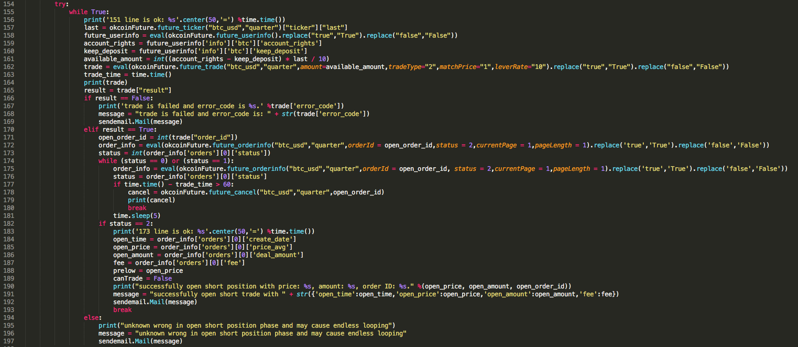

My interests lie in the general area of quantitative finance, particularly in algorithm trading, quant research and risk management.

Quantitative finance is a large discipline and I break it down into three relevant areas:

1. Quantitative Trading (focus on industry and practical application)
2. Mathematical Finance (emphasize on fundamental knowledge such as Math, Stat, Prob and Finance)
3. Programming and software development (coding skill)

The purpose of this website is to serve as notes for the above topics that I think is important and worthy of documentation. I will try to update frequently and hope you can find something useful!

 

 
 
 